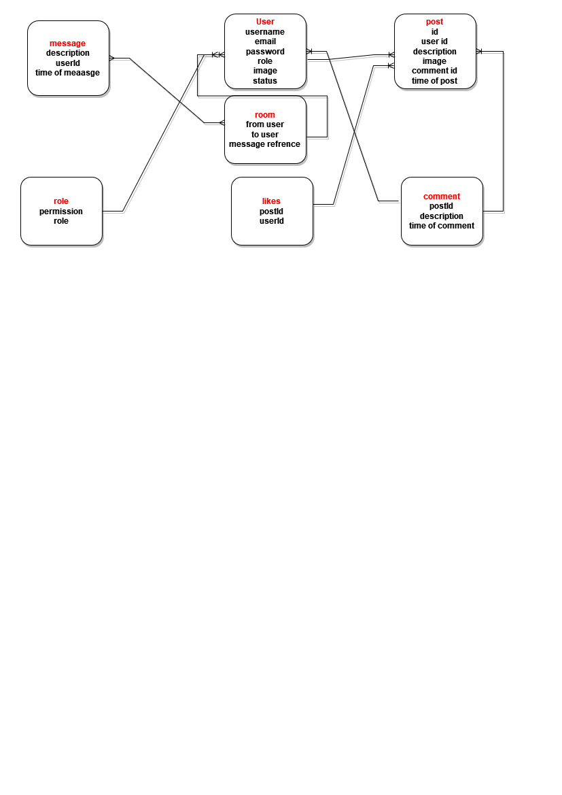
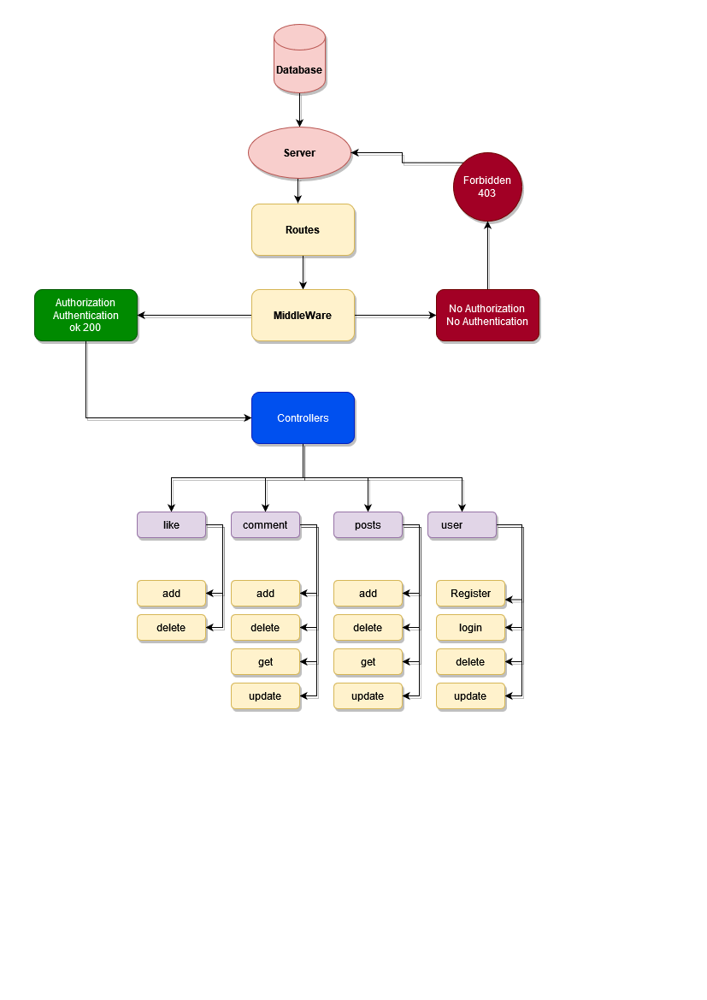

# Graduation-Project

## Description
### Creating Community WebSite of programmers , which users can register with new account 

## User Story 
 ### Register : Create New account and active account with confirmation email .
 ### Login : Signin and Start use features offered .
 ### Logout : As a user i can Signout so nobody can use my Inof
 ### Create : I can create new Posts related to event or programming problem , Comments , Answer to any questions
 ### Edit : Previous posts or comment or answers
 ### Delete : Previous posts or comment or answers
 ### Edit Profile : as user if signed can edit profile
 ### Answer : Can add Answers to questions
 ### Admins there have full control like Delete and update and spam users with admin dashboard
 ### Users Can add and update thire own Posts 
#### server side url https://github.com/MP-Project-Sultan/client
#### project deployed there https://quirky-dubinsky-3af6fa.netlify.app
#### Trello link https://trello.com/b/6I1hyUj7

###
 HTTP Method  | authorization     |    Path                            |  Request  Body       | HTTP Code              
------------- | -----------   | ---------------------------            |----------------------  |---------
POST          | everyone      |`/user/create`        |{email,username, password, role} | ok 200 , error 400
POST          | user + admin  |`/user/login`                        |{email or username, password}| ok 200 , error 400
GET           | admin only    |`/user/`                           | | ok 200 , error 400
DELETE        | admin only    |`/user/deleteusrid/:_id`             |   |ok 200 , error 400
GET           | user          |`/user/confirmation/:confcode/`     |    |ok 200 , error 400
PUT           | user          |`/user/forgetPassword`          |{email}|ok 200 , error 400
PUT           | user          |`/user/resetPassword` |{resetCode, newPassword} | ok 200 , error 400
POST          | everyone      |`/user/googlelogin`  |{Token id} | ok 200 , error 400
post          | admin + user  |`/likes/`     |{userId, PostId} | ok 200 , error 400
delete        | admin + user  |`/likes/:id`                  |{like id}| ok 200 , error 400
GET           | admin + user  |`/likes/:PostId`                    |{postId}| ok 200 , error 400
POST          | admin + user  |`/comment/addComment`                  |{title, postId, userId}| ok 200 , error 400
PUT           | admin + user  |`/comment/update`                    |{commentId, description}| ok 200 , error 400
DELETE        | admin + user  |`/comment/delete/:id`                  | | ok 200 , error 400
GET           | admin + user  |`/posts/`                               | | ok 200 , error 400
GET           | admin + user  |`/posts/getPost/:postid`                || ok 200 , error 400
POST          | admin + user  |`/posts/addpost`                    |{img, description} | ok 200 , error 400
PUT           | admin + user  |`/posts/updatepost/:_id`               |{id}| ok 200 , error 400
DELETE        | admin + user  |`/posts/delete/:_id`                | | ok 200 , error 400

 

## ERD

## Models

- user model

| key        | type            | options          | default value |
| ---------- | --------------- | ---------------- | ------------- |
| username   | String          | required, unique | n/a           |
| email      | String          | required, unique | n/a           |
| password   | String          | required         | n/a           |
| roles      | Schema <roles>  | required         | n/a           |
| status     | Boolean         | n/a              | false         |

- roles model

| key  | type   | options          | default value |
| ---- | ------ | ---------------- | ------------- |
| role | String | required, unique | n/a           |

- posts model

| key         | type              | options  | default value |
| ----------- | ----------------- | -------- | ------------- |
| description | String            | required | n/a           |
| userId      | Schema <user>     | required | n/a           |
| time        | Number            | required | n/a           |

- comments model

| key         | type            | options  | default value |
| ----------- | --------------- | -------- | ------------- |
| userId      | Schema <user>   | required | n/a           |
| description | String          | required | n/a           |
| postId      | Schema <post>   | required | n/a           |

- room model

| key         | type            | options  | default value |
| ----------- | --------------- | -------- | ------------- |
| to          | Schema <user>   | required | n/a           |
| from        | Schema <user>   | required | n/a           |
| description | String          | required | n/a           |

- like model

| key         | type            | options  | default value |
| ----------- | --------------- | -------- | ------------- |
| userId      | Schema <user>   | required | n/a           |
| postId      | Schema <posts> | required | n/a            |

- message model 

| key      | type             | options  | default value |
| -------- | ---------------- | -------- | ------------- |
| user1    | Schema <user>    | required | n/a           |
| user2    | Schema <user>    | required | n/a           |
| messages | array of objects | required | n/a           |

## UML

