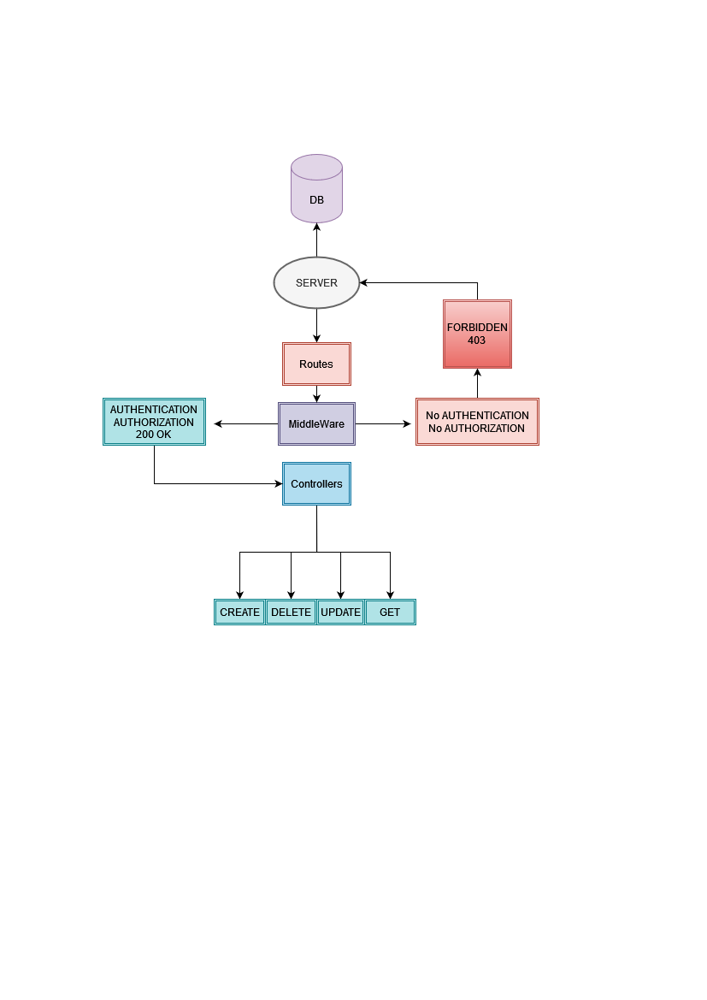

# Graduation-Project

## Description
### Creating Community WebSite of programmers , which users can register with new account 

## User Story 
 ### Register : Create New account and active account with confirmation email .
 ### Login : Signin and Start use features offered .
 ### Logout : As a user i can Signout so nobody can use my Inof
 ### Create : I can create new Posts related to event or programming problem , Comments , Answer to any questions
 ### Edit : Previous posts or comment or answers
 ### Delete : Previous posts or comment or answers
 ### Edit Profile : as user if signed can edit profile
 ### Answer : Can add Answers to questions
 ### Admins there have full control like Delete and update and spam users with admin dashboard
 ### Users Can add and update thire own Posts 

###
 HTTP Method  | authorization     |    Path                                |  Request Body
------------- | -----------   | ---------------------------            |----------------------
POST          | everyone      |`/user/create`                          |{email,username, password, role}
POST          | user + admin  |`/user/login`                           |{email or username, password}
GET           | admin only    |`/user/`                                |
DELETE        | admin only    |`/user/deleteusrid/:_id`                |
GET           | user          |`/user/confirmation/:confcode/`         |
PUT           | user          |`/user/forgetPassword`                  |{email}
PUT           | user          |`/user/resetPassword`                   |{resetCode, newPassword}
POST          | everyone      |`/user/googlelogin`                     |{Token id}
post          | admin + user  |`/likes/`                               |{userId, PostId}
delete        | admin + user  |`/likes/:id`                            |{like id}
GET           | admin + user  |`/likes/:PostId`                        |{postId}
POST          | admin + user  |`/comment/addComment`                   |{title, postId, userId}
PUT           | admin + user  |`/comment/update`                       |{commentId, description}
DELETE        | admin + user  |`/comment/delete/:id`                   |
GET           | admin + user  |`/posts/`                               |
GET           | admin + user  |`/posts/getPost/:postid`                |
POST          | admin + user  |`/posts/addpost`                        |{img, description}
PUT           | admin + user  |`/posts/updatepost/:_id`                |{id}
DELETE        | admin + user  |`/posts/delete/:_id`                    |

## UML

## ERD

